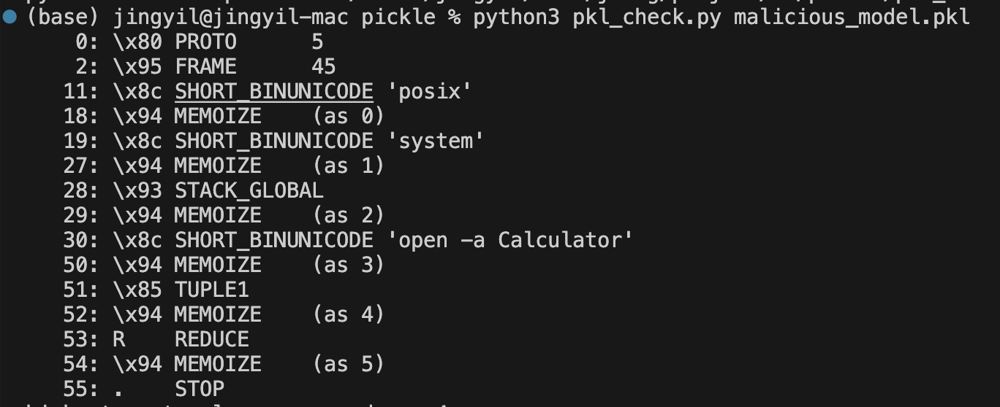

## 模拟 Pickle 反序列化恶意攻击
###  malicious_model.py
黑客的恶意代码
生成 pkl 文件，模拟模型文件
```
python3 malicious_model.py  
```

### demo.py
正常代码，准备加载模型。
加载了恶意模型 malicious_model.pkl
```
python3 demo.py
```
打开了计算器

### pkl_check.py
检查 pkl 文件流
python3 pkl_check.py <pkl file>


